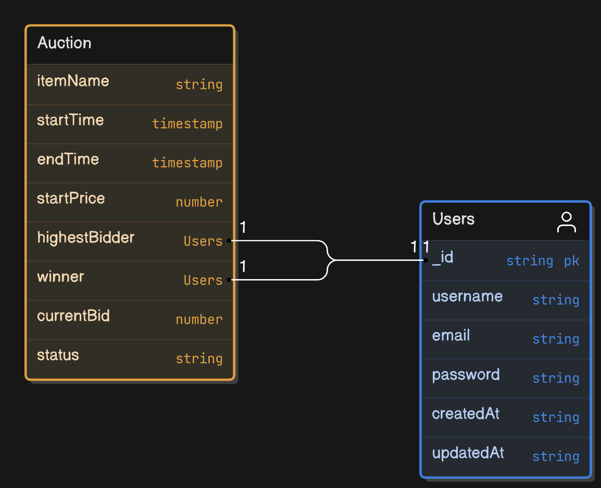
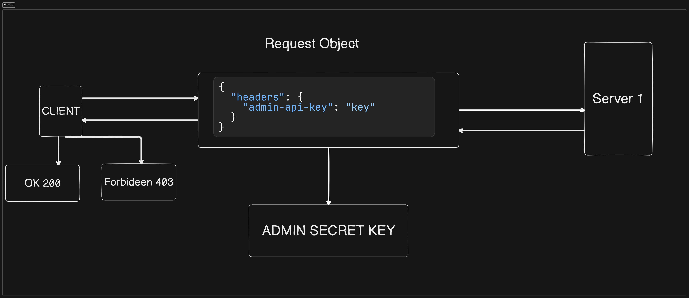
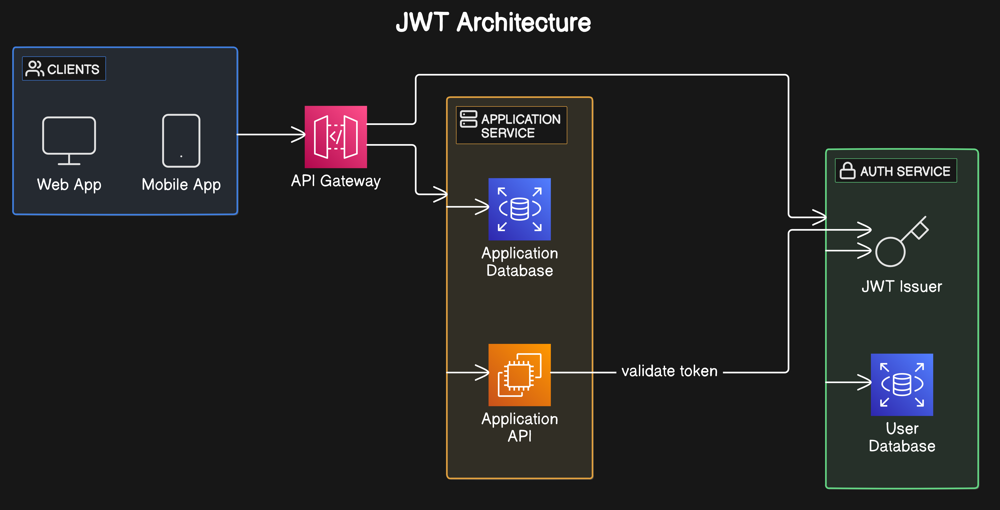

# Auction System Implementation

## 1. **Initial Planning and Setup**

- I started by thoroughly understanding the requirements for both microservices: user management and auction management. The user management service handled user data and authentication, while the auction service managed auctions and bidding.

## 2. **Database Design**

- **User Management Microservice**:

  - I designed a `User` schema with fields such as `username`, `email`, and `password` using Mongoose for schema definition and database interaction.

- **Auction Management Microservice**:

  - I created an `Auction` schema with fields including `itemName`, `startTime`, `endTime`, `startPrice`, `currentBid`, `highestBidder`, `winner`, and `status`, ensuring efficient management of auctions.

## 3. **Authentication and Authorization**

### 1. Static API Secret for Admin:

I implemented a middleware function to secure admin routes using a static API secret, restricting CRUD operations on users and auctions to authenticated admins.

### 2. JWT for User Authentication:

I developed a user login functionality that issued a JSON Web Token (JWT) upon successful authentication, which was then used to secure and authorize user actions such as placing bids.

## 4. User Management Microservice Implementation

### 1. User Registration and Login:

- I created a `UserController` with methods for user registration, login, and CRUD operations. Passwords were hashed using `bcryptjs` before being saved to the database, and JWTs were generated upon login.

### 2. Admin CRUD Operations:

I protected admin routes with the static API secret, allowing secure CRUD operations on user data.

## 5. Auction Management Microservice Implementation

### 1. Auction CRUD Operations:

- I implemented an `AuctionController` to manage auction data, including creating, reading, updating, and deleting auctions, with proper validation for auction start and end times.
- **Viewing Auctions**:

  - I developed routes to display all ongoing auctions, filtering them based on the current time to ensure users only saw active auctions.

- **Bidding System**:

  - I allowed authenticated users to place bids on active auctions, updating the `currentBid` and `highestBidder` fields when a higher bid was placed. I also ensured that bids were only accepted before the auction's end time.

- **Determining Auction Winners**:

  - I implemented a service that checked for completed auctions and updated the `status` and `winner` fields. To automate this, I utilized a queue system with Redis and Bull, which triggered tasks when the auction `endTime` was reached, ensuring the `winner` was correctly determined and update

[View on Eraser](https://app.eraser.io/workspace/OS4u76PBz9obj2ghFppL?elements=vauB9nwb70C8oLbODToSFg)

## 6. **Error Handling and Validation**

- **Centralized Error Handling**:

  - I implemented centralized error handling middleware to log errors and return meaningful messages to the client.

- **Input Validation**:

  - I used `validator` to validate incoming data, ensuring all required fields were present and correctly formatted.

## 8. **Unit Testing**

- **Test Controllers and Services**:

  - I wrote unit tests for the controllers and services using `Jest`, covering both successful operations and edge cases.

- **Test Authentication**:

  - I also tested the JWT generation and protected routes to ensure they were secure.
